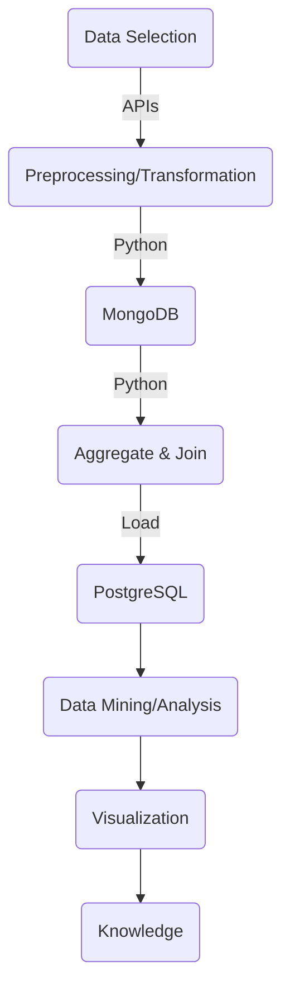
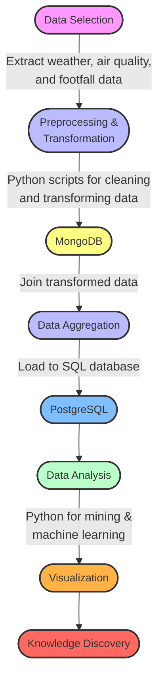
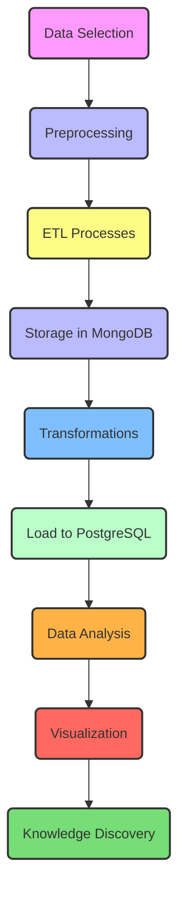

# TeamAA_DAP_JAN2024
Database and Analytics Programming Team Project 

Team members
1. Ankith Babu Joseph- x23185813
2. Alphons Zacharia James- x23169702
3. Abhilash Janardhanan- x23121424

```mermaid
graph LR
    subgraph Stage 1 - Data Selection
    DS([Data Selection]) -->|Extract from APIs| PP
    end

    subgraph Stage 2 - Preprocessing & Transformation
    PP([Preprocessing & Transformation]) --> MDB
    end
    
    subgraph Stage 3 - Data Integration
    MDB([MongoDB]) -->|Join| AJ
    end
    
    subgraph Stage 4 - Data Loading
    AJ([Aggregated Data]) -->|Load to PostgreSQL| PS
    end
    
    subgraph Stage 5 - Analysis & Knowledge Discovery
    PS([PostgreSQL]) --> DA([Data Analysis])
    DA --> VIS([Visualization])
    VIS --> KN([Knowledge Discovery])
    end
    
    style DS fill:#f9f,stroke:#333,stroke-width:2px
    style PP fill:#bbf,stroke:#333,stroke-width:2px
    style MDB fill:#fdfd86,stroke:#333,stroke-width:2px
    style AJ fill:#bbf,stroke:#333,stroke-width:2px
    style PS fill:#80bfff,stroke:#333,stroke-width:2px
    style DA fill:#baffc9,stroke:#333,stroke-width:2px
    style VIS fill:#ffb347,stroke:#333,stroke-width:2px
    style KN fill:#ff6961,stroke:#333,stroke-width:2px
    
    classDef defaultFont font-family:'Arial',font-size:14px;
    class DS,PP,MDB,AJ,PS,DA,VIS,KN defaultFont
```








```
digraph G {
    node [shape=box, style=filled, color=lightblue];

    subgraph cluster_0 {
        label="Data Selection";
        APIs [label="APIs\n(Weather, Air Quality, Footfall)"];
    }

    subgraph cluster_1 {
        label="Preprocessing, Transformation & Storage";
        Preprocessing [label="Preprocessing\nPython Scripts"];
        Transformation [label="Transformation\nPython Scripts"];
        MongoDB [label="MongoDB\n(NoSQL Database)"];
        Preprocessing -> MongoDB;
        Transformation -> MongoDB;
    }

    subgraph cluster_2 {
        label="Data Mining/Analysis and Visualizations";
        Postgres [label="PostgreSQL\n(SQL Database)"];
        Analysis [label="Data Analysis\nPython Scripts"];
        Visualization [label="Data Visualization"];
        MongoDB -> Postgres;
        Postgres -> Analysis;
        Analysis -> Visualization;
    }

    subgraph cluster_3 {
        label="Knowledge";
        Knowledge [shape=ellipse, label="Insights and\nDecision Making"];
    }

    APIs -> Preprocessing;
    MongoDB -> Knowledge [style=dotted];
    Visualization -> Knowledge;
}
```