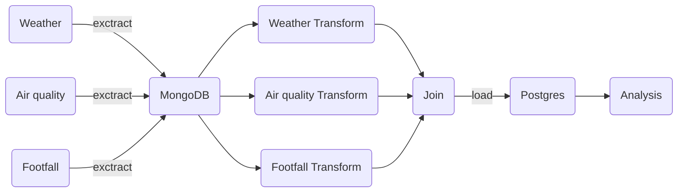

## Datasets

- [Open-Meteo](https://open-meteo.com/)   Free Weather API
- [Pedestrian Footfall DCC](https://data.smartdublin.ie/dataset/dublin-city-centre-footfall-counters)  Pedestrian footfall counts of people at a number of locations in Dublin city. Passersby are counted and logged every hour, 24 hours per day, 7 days per week using a network of PYRO-Box people counters located throughout central Dublin. Data is provided by Dublin City Council and the NTA.

## Related study materials/courses 

- [Docker | Datacamp ](https://app.datacamp.com/learn/courses/introduction-to-docker) Learn the Docker basics and understand how to create and manage containers using Dockerfiles and instructions.
- [Data Engineering | Datacamp ](https://app.datacamp.com/learn/courses/introduction-to-data-engineering) Introduction to Data Engineering

## work flow

